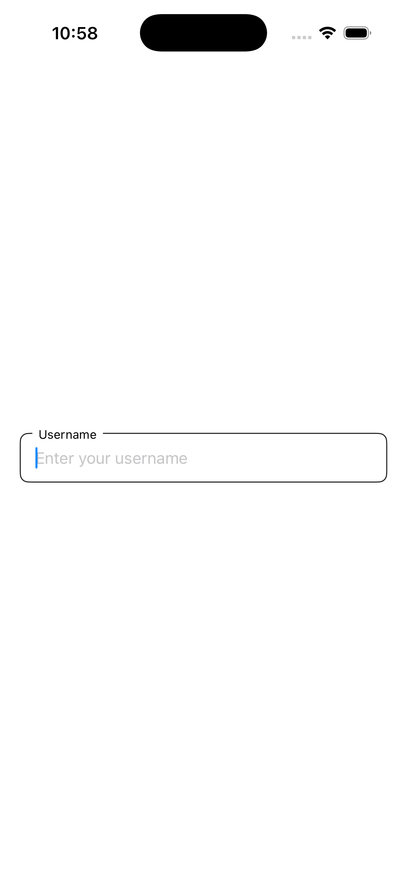
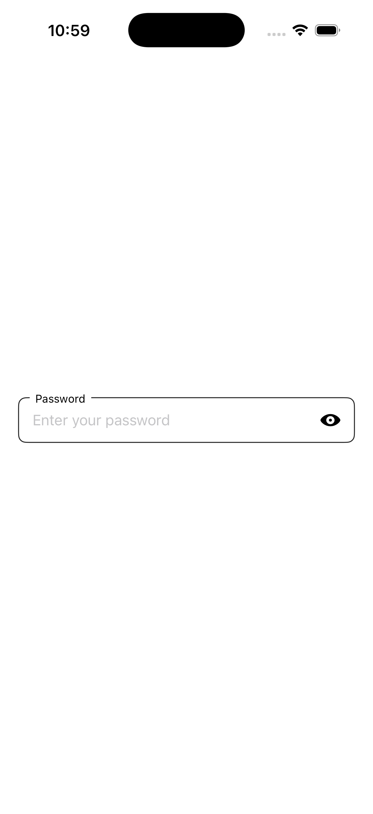
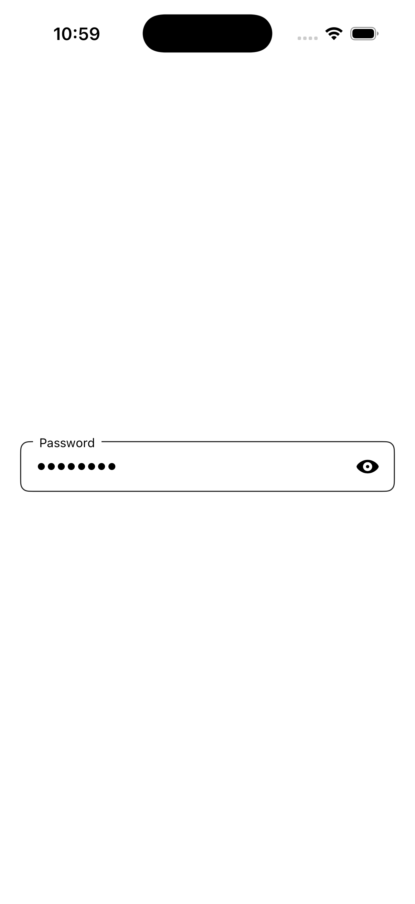

# FloatingLabelTextField

A lightweight and customizable **SwiftUI text field with a floating label**.  
This package provides a Material Design–inspired floating label input field for iOS, making form UIs clean, modern, and user-friendly.

---


## ✨ Features

- ✅ Floating label with customizable font and color  
- ✅ Secure text entry with **show/hide password** toggle  
- ✅ Fully customizable:
  - Height  
  - Corner radius  
  - Border color and width  
  - Label font and color  
  - Text font  
- ✅ Supports **iOS 14+**  
- ✅ Swift Package Manager support  

---

## 🖼 Example Preview
Here’s how it looks in the demo:

<p float="left">
  
  
  
  
</p>

## 📦 Installation

### Swift Package Manager

You can add **FloatingLabelTextField** to your project in **two ways**:

1. **Xcode**  
   - Go to `File > Add Packages...`  
   - Enter the URL of this repo:  

     ```
     https://github.com/devstacklimited/FloatingLabelTextField.git
     ```

   - Select the version rule and finish.

2. **Package.swift**  

   ```swift
   dependencies: [
       .package(url: "https://github.com/devstacklimited/FloatingLabelTextField.git", from: "1.0.0")
   ]
   ```


## 🚀 Usage

```swift
import SwiftUI
import FloatingLabelTextField

struct ContentView: View {
    @State private var username: String = ""
    @State private var password: String = ""
    
    var body: some View {
        VStack(spacing: 20) {
            // Normal TextField
            FloatingLabelTextField(
                label: "Username",
                text: $username,
                placeholder: "Enter your username",
                labelColor: .gray,
                borderColor: .blue,
                labelFont: .system(size: 14, weight: .medium),
                textFont: .system(size: 16)
            )
            
            // Secure TextField with toggle
            FloatingLabelTextField(
                label: "Password",
                text: $password,
                placeholder: "Enter your password",
                isSecure: true,
                labelColor: .gray,
                borderColor: .red,
                labelFont: .system(size: 14, weight: .medium),
                textFont: .system(size: 16)
            )
        }
        .padding()
    }
}
```


## ⚙️ Parameters

| Parameter            | Type                           | Default             | Description                   |
| -------------------- | ------------------------------ | ------------------- | ----------------------------- |
| `label`              | `String`                       | —                   | Floating label text           |
| `text`               | `Binding<String>`              | —                   | Bound text value              |
| `placeholder`        | `String?`                      | `nil`               | Placeholder text              |
| `isSecure`           | `Bool`                         | `false`             | Enables secure entry + toggle |
| `labelColor`         | `Color`                        | `.black`            | Floating label text color     |
| `keyboardType`       | `UIKeyboardType`               | `.default`          | Keyboard type                 |
| `autocapitalization` | `TextInputAutocapitalization?` | `.sentences`        | Autocapitalization mode       |
| `height`             | `CGFloat`                      | `48`                | Field height                  |
| `cornerRadius`       | `CGFloat`                      | `8`                 | Border corner radius          |
| `borderColor`        | `Color`                        | `.primary`          | Border color                  |
| `borderWidth`        | `CGFloat`                      | `1`                 | Border width                  |
| `labelFont`          | `Font`                         | `.system(size: 12)` | Label font                    |
| `textFont`           | `Font`                         | `.system(size: 16)` | Input text font               |


## 💡 Contributing
Contributions, issues, and feature requests are welcome!
If you use this library and like it, **don’t forget to star the repo** ⭐️. It helps the project grow and reach more developers.


## 📝 License
FloatingLabelTextField is available under the MIT License.
